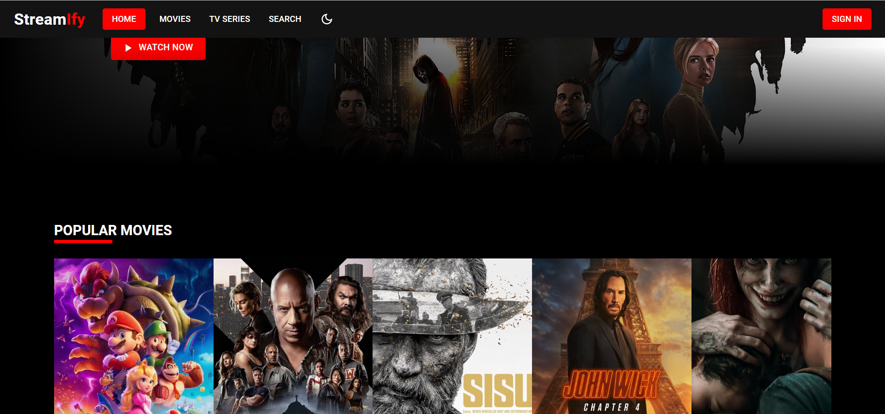
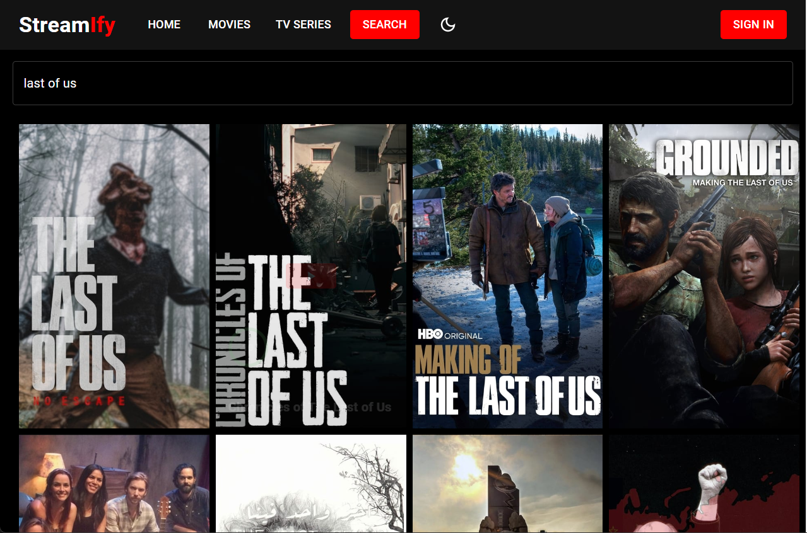
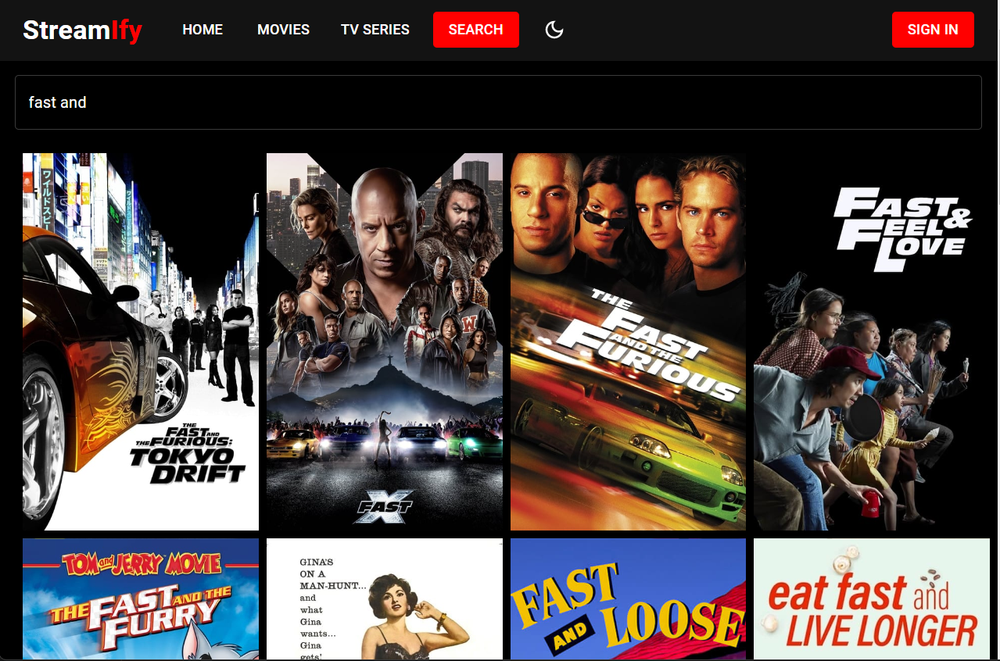

# Movie Streaming Website

Welcome to our Movie Streaming Website! This web application allows you to view movies online. It was built using React, Material UI, Mongoose, ExpressJS, Express Validator, React Router, Formik, Yup, Axios, Themoviedb, Swiper, and JWT.

## Features

- View a collection of movies
- Search for movies
- Watch movie trailers
- User authentication and authorization
- User registration and login
- Add movies to favorites
- Browse movie categories
- Responsive design

## Technologies Used

- [React](https://reactjs.org/) - JavaScript library for building user interfaces.
- [Create React App](https://create-react-app.dev/) - Set up a modern React web application.
- [Material UI](https://material-ui.com/) - React UI components library with Material Design.
- [Mongoose](https://mongoosejs.com/) - MongoDB object modeling for Node.js.
- [ExpressJS](https://expressjs.com/) - Fast and minimalist web framework for Node.js.
- [Express Validator](https://express-validator.github.io/) - Middleware for validating and sanitizing data in Express.
- [React Router](https://reactrouter.com/) - Declarative routing for React.
- [Formik](https://formik.org/) - Form library for React.
- [Yup](https://github.com/jquense/yup) - JavaScript schema builder for value parsing and validation.
- [Axios](https://axios-http.com/) - Promise-based HTTP client for the browser and Node.js.
- [ThemovieDB](https://www.themoviedb.org/) - API for accessing movie and TV show data.
- [Swiper](https://swiperjs.com/) - JavaScript library for building responsive touch sliders.
- [JWT](https://jwt.io/) - JSON Web Token for user authentication.

## Getting Started

Follow these steps to run the project on your local machine:

1. Clone the repository: `git clone <repository-url>`
2. Navigate to the project directory: `cd movie-streaming-website`
3. Install dependencies: `npm install`
4. Start the development server: `npm start`
5. Open your browser and access the website at [http://localhost:3000](http://localhost:3000)

## Screenshots

